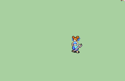

# [\[Dancer-Base\] \[F\] Vanilla FE6 Larum +FE7-8, Staff](./)  

## Sword

| Still | Animation |
| :---: | :-------: |
|  |  |

## Credit

Vanilla animation made by IS.

Staff by Vilkalizer.

Refresh (Fixed SFX) by Eldritch Abomination.

Refresh (Heart FE8 Compatible) by SHYUTERz.

Sword by Yerek.
