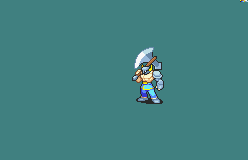

# [\[Berserker-Base\] \[M\] Vanilla Repal by Blue Druid](./) %20Brigs%2C%20Pirates%2C%20Zerkers%2F%5BBerserker-Base%5D%20%5BM%5D%20Vanilla%20Repal%20by%20Blue%20Druid%2F3.%20Axe%20(magic%20axe))

## Axe

| Still | Animation |
| :---: | :-------: |
|  |  |

## Credit

Original Berserker by IS.

Repalette by Blue Druid.

Magic Axe by Raulster. Inspired by DerTheVaporeon's Berserker animation.
