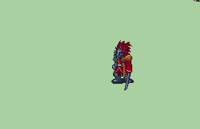

# [\[Berserker-Custom\] Bushido Doogzerker \[U\]](./) %20Brigs%2C%20Pirates%2C%20Zerkers%2F%5BBerserker-Custom%5D%20Bushido%20Doogzerker%20%5BU%5D%2F1.%20Sword) 

## Sword

| Still | Animation |
| :---: | :-------: |
|  |  |

## Credit

F2U/F2E

Base animation taken from the Bushido Swordzerker by Intestine.

Pauldron and palette referenced from Aruka's Dozlazerker.

Coat referenced from Greentea's Farguszerker.

Fire effects borrowed from Aruka's Salamander Rider.

Fire palette referenced from DerTheVaporeon's Cursed Sword.

Full credits:

IS, Maiser6, TBA, Intestine, Aruka, Kenpuhu, Greentea, RobertFPY, DerTheVaporeon, Team SALVAGED.

Ranged Sword animation by Seliost1.

Unarmed by Seliost1.
