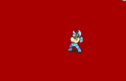

# [\[Berserker-Variant\] Sideslash Vanilla-Style \[M\] by Der](./) %20Brigs%2C%20Pirates%2C%20Zerkers%2F%5BBerserker-Variant%5D%20Sideslash%20Vanilla-Style%20%5BM%5D%20by%20Der%2F4.%20Handaxe) 

## Handaxe

| Still | Animation |
| :---: | :-------: |
|  |  |

## Credit

F2U/F2E

Side-slashing Dozlazerker variant originally made by Aruka and Kenpuhu.

Derserker variant made by DerTheVaporeon.

Sword by CookieMaster.

Axe (Alt Crit) by Enthusiasm.
