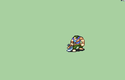

# [\[Brigand-Reskin\] \[M\] Fully-Clothed Reskin](./) %20Brigs%2C%20Pirates%2C%20Zerkers%2F%5BBrigand-Reskin%5D%20%5BM%5D%20Fully-Clothed%20Reskin%2F3.%20Axe) 

## Axe

| Still | Animation |
| :---: | :-------: |
|  |  |

## Credit

Made by Flasuban.

Reskin by UltraFenix. 

Note: Unlike V2, where the pants colors use the same palette as the axe, this version uses the hair colors on the pants.
