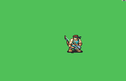

# [\[Fighter-Type\] \[M\] Tellius-Style Bow-Only](./) %20Fighters%20and%20Warriors%2F%5BFighter-Type%5D%20%5BM%5D%20Tellius-Style%20Bow-Only%2F5.%20Bow)

## Bow

| Still | Animation |
| :---: | :-------: |
|  |  |

## Credit

Made by Leo_Link, knabepicer.

Note that while this bow animation is similar to Leo_Link's axe-only Tellius-Style Fighter, they are not actually a pair. Perhaps an update to make them visually similar is in order?
