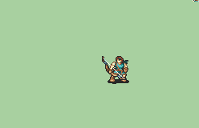

# [\[Fighter-Variant\] Tellius-Style Bow-Only \[F\]](./) %20Fighters%20and%20Warriors%2F%5BFighter-Variant%5D%20Tellius-Style%20Bow-Only%20%5BF%5D%2F5.%20Bow) 

## Bow

| Still | Animation |
| :---: | :-------: |
|  |  |

## Credit

F2U/F2E

Bow by Leo_Link, knabepicer.

Unarmed by Pushwall.

Female version edits by Blademaster

Note that while this bow animation is similar to Leo_Link's axe-only Tellius-Style Fighter, they are not actually a pair. Perhaps an update to make them visually similar is in order?

