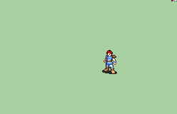

# [\[Journeyman-Type\] Waleed's Squire V3](./) %20Fighters%20and%20Warriors%2F%5BJourneyman-Type%5D%20Waleed's%20Squire%20V3%2F8.%20Unarmed) 

## Unarmed

| Still | Animation |
| :---: | :-------: |
|  |  |

## Credit

F2U/F2E

Original [Journeyman] by IS

Squire made by Waleed

Additions made by Booster_Seat87

Ranged animation from Journeyman-base Vanilla + Weapons Seliost1

Keeps v2 design and Repal and adds ranged animations, unarmed animations, and a more mercenary accurate dodge frame
