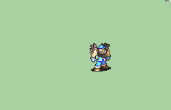

# [\[Warrior-Base\] Repal Bandana \[M\] by Pushwall](./) %20Fighters%20and%20Warriors%2F%5BWarrior-Base%5D%20Repal%20Bandana%20%5BM%5D%20by%20Pushwall%2F8.%20Unarmed) 

## Unarmed

| Still | Animation |
| :---: | :-------: |
|  |  |

## Credit

F2U/F2E

Original Warrior by IS.

Repalette/bandana by Pushwall.

NOTE: The Magic Axe rotation becomes blurry when imported through FeBuilder. The Non-Magic Axe does not have this issue.
