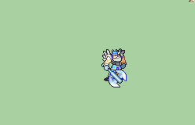

# [\[Warrior-Base\] Vanilla +Magic \[M\]](./) %20Fighters%20and%20Warriors%2F%5BWarrior-Base%5D%20Vanilla%20%2BMagic%20%5BM%5D%2F3.%20Axe%20(%2BHandaxe)) 

## Axe

| Still | Animation |
| :---: | :-------: |
|  |  |

## Credit

F2U/F2E

Original Warrior by IS. 

Magic axe frames by UltraFenix.

Magic and Staff by Orihara_Saki.

Realer Axe by Sphealnuke. Commissioned by MournfulRelic.

Axe (+Handaxe) by Yerek.
