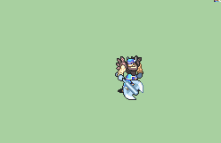

# [\[Warrior-Base\] \[M\] Repal Leather by Pushwall](./) %20Fighters%20and%20Warriors%2F%5BWarrior-Base%5D%20%5BM%5D%20Repal%20Leather%20by%20Pushwall%2F3.%20Axe) 

## Axe

| Still | Animation |
| :---: | :-------: |
|  |  |

## Credit

Original Warrior by IS.

Repalette by Pushwall. 

Alternate Axe by a3d3.

Realer Axe Repal By Sphealnuke and ported by UltraFenix.

NOTE: The Magic Axe rotation becomes blurry when imported through FeBuilder. The Non-Magic Axe and the Realer Axe does not have this issue.

Lance by LoreLeek.

Sword by LoreLeek.
