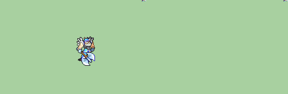
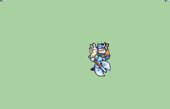

# [\[Warrior-Base\] \[M\] Vanilla +Magic](./) %20Fighters%20and%20Warriors%2F%5BWarrior-Base%5D%20%5BM%5D%20Vanilla%20%2BMagic%2F3.%20Axe%20(Realer%20Axe)) 

## Axe

| Still | Animation |
| :---: | :-------: |
|  |  |

## Credit

Original Warrior by IS. 

Magic and Staff by Orihara_Saki.

Realer Axe by Sphealnuke. Commissioned by MournfulRelic.

