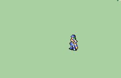

# [\[Archer-Base\] Helmet \[F\] by Craigrandall55](./) %20Archers%20and%20Hunters%2F%5BArcher-Base%5D%20Helmet%20%5BF%5D%20by%20Craigrandall55%2F6.%20Magic) 

## Magic

| Still | Animation |
| :---: | :-------: |
|  |  |

## Credit

F2U/F2E

Flasuban, DerTheVaporeon, Merple, Alusq, JeyTheCount, Maiser6, IS, Craigrandall55.

Flasuban was credited by DerTheVaporeon in their Repalette of base female Archer.

Merple credited themself and IS in their magic animation.

Maiser6, JeyTheCount, and Alusq were all credited in the Lightweight Lancer animation I took the helmet from.

Craigrandall55 put this together with help from the Discord.
