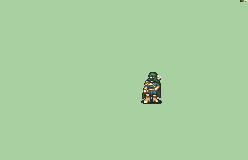

# [\[HunterD\] \[F\] Hunter by Deranger](./) %20Archers%20and%20Hunters%2F%5BHunterD%5D%20%5BF%5D%20Hunter%20by%20Deranger%2F8.%20Unarmed) 

## Unarmed

| Still | Animation |
| :---: | :-------: |
|  |  |

## Credit

Made by Deranger.

Female variant by Jey the Count.

Note that Deranger's hunters are among the oldest in the community, and as such, could use some touchups. MeatOfJustice made a revamped Hunter, but a simple set of timing/frame fixes for the original Ranger does not yet exist.
