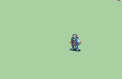

# [\[Soldier-Custom\] \[M\] FE10-Style Helmetless](./) %20Soldiers%2C%20Halberdiers%2F%5BSoldier-Custom%5D%20%5BM%5D%20FE10-Style%20Helmetless%2F8.%20Unarmed) 

## Unarmed

| Still | Animation |
| :---: | :-------: |
|  |  |

## Credit

Flasuban sprited the base version of the FE10 Soldier.

Slow/Angled is Flasuban's first version.

Fast/Straight is a revision based off the vanilla GBA Soldier movements, made to look more like the GBA timings. This was animated by Nuramon.

Sword animation is based on the Fast/Straight animation done by Nuramon. This was animated by Craigrandall55.

Helmeteless by UltraFenix.
