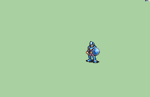

# [\[Soldier-Custom\] \[M\] FE10-Style by Nuramon](./) %20Soldiers%2C%20Halberdiers%2F%5BSoldier-Custom%5D%20%5BM%5D%20FE10-Style%20by%20Nuramon%2F8.%20Unarmed%20(Straight%2C%20Fast))

## Unarmed

| Still | Animation |
| :---: | :-------: |
|  |  |

## Credit

There are two animations in this folder, both based off the FE10 Soldier still-image by Jeorge Reds.

Flasuban made the base version of the FE10 Soldier, animating it from Jeorge Red's still.

Nuramon then made two new revisions, namely the Fast/Straight and Slow/Angled versions.

Slow/Angled is the first version Nuramon made.

Fast/Straight is a revision based off the vanilla GBA Soldier movements, made to look more like the GBA timings.
