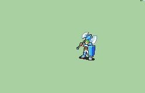

# [\[Hero-Base\] Vanilla FE6 +Basic Shield \[M\]](./) %20Mercenaries%20and%20Heroes%2F%5BHero-Base%5D%20Vanilla%20FE6%20%2BBasic%20Shield%20%5BM%5D%2F3.%20Axe%20(Armads%20-%20FE7)%20(with%20rotation)) 

## Axe

| Still | Animation |
| :---: | :-------: |
|  |  |

## Credit

F2U/F2E

Made by IS.

Axe (+Handaxe) by Yerek.

Sword (Durandal) animation by tatata.

Axe (Armads) animation by tatata.
