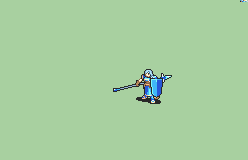

# [\[Hero-Base\] Vanilla FE6 Echidna +Lance \[F\]](./) %20Mercenaries%20and%20Heroes%2F%5BHero-Base%5D%20Vanilla%20FE6%20Echidna%20%2BLance%20%5BF%5D%2F2.%20Lance) 

## Lance

| Still | Animation |
| :---: | :-------: |
|  |  |

## Credit

F2U/F2E

Animation by IS.

Lance by Pushwall.

Axe (+Handaxe) by Yerek.

Shield Edit by tatutachang.

Sword (Durandal) animation by tatata.

Axe (Armads) animation by tatata.

Note: The shield edit does not use the shield loop command in the script. It can be edited frame by frame.
