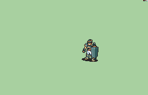

# [\[Hero-Reskin\] Joshua's Hat \[M\] by Jaden](./) %20Mercenaries%20and%20Heroes%2F%5BHero-Reskin%5D%20Joshua's%20Hat%20%5BM%5D%20by%20Jaden%2F1.%20Sword) 

## Sword

| Still | Animation |
| :---: | :-------: |
|  |  |

## Credit

F2U/F2E

Vanilla animation by IS.

Hat by SD9K

Edit by darkjaden
	- when importing the Unarmed animation, it displays a palette error, but "Ignore and force input" seems to work fine,
	if anyone wants to fix this for me, feel free!

