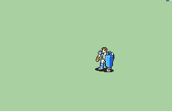

# [\[Hero-Reskin\] \[M\] FE7 Armor +Basic Shield \(Vanilla\) +Lance](./) %20Mercenaries%20and%20Heroes%2F%5BHero-Reskin%5D%20%5BM%5D%20FE7%20Armor%20%2BBasic%20Shield%20(Vanilla)%20%2BLance%2F3.%20Axe%20(Shield%20Edit))

## Axe

| Still | Animation |
| :---: | :-------: |
|  |  |

## Credit

Vanilla animation by IS.

Lance by Pushwall.

Shield Edit by tatutachang.

Note: The shield edit does not use the shield loop command in the script. It can be edited frame by frame.
