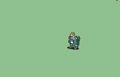

# [\[Hero-Variant\] Armored +Fox Ears \[F\]](./) %20Mercenaries%20and%20Heroes%2F%5BHero-Variant%5D%20Armored%20%2BFox%20Ears%20%5BF%5D%2F4.%20Handaxe%20(Spin%20Crit)) 

## Handaxe

| Still | Animation |
| :---: | :-------: |
|  |  |

## Credit

F2U/F2E

Made by {Flasuban, Nuramon}

Handaxe Spin Crit by Sax Marine, added by ltranc.

Removal of white pixel in face by Itranc.

Elf ear version by Seliost1.

3. Axe (Magic axe - bright flash crit) by Seliost1.
