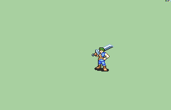

# [\[Mercenary-Base\] Vanilla FE7-8 +Weapons \[M\]](./) %20Mercenaries%20and%20Heroes%2F%5BMercenary-Base%5D%20Vanilla%20FE7-8%20%2BWeapons%20%5BM%5D%2F1.%20Sword%20(Combo%20Crit)) 

## Sword

| Still | Animation |
| :---: | :-------: |
|  |  |

## Credit

F2U/F2E

Vanilla Mercenary by IS. (Sword, Unarmed)

Greatsword by SD9K.

Axe and Handaxe by PrincessKilvas.

Sword (Combo Crit) by Seliost1, ported by tatata.

Sword (FF7 - Cloud) by  Lord Zymeth and Yangfly Master, pported by tatata.

Sword (Flashy Ranged + Materia Ranged) by Seliost1, ported by tatata.

Sword (Blue Mage Sword) by  Linkain and Lord Zymeth, ported by tatata.

Magic by Linkain and Lord Zymeth, ported by tatata.

All Dragonstone related anims by tatata.
