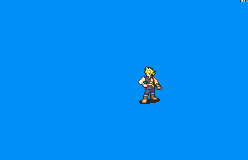

# [\[FE7 Hector-Type\] \[M\] FF7 - Cloud by FlyingAce](./)  

## Magic

| Still | Animation |
| :---: | :-------: |
|  |  |

## Credit

Made by FlyingAce24.

Improved by Dark Seraph.

Sword (Traditional Ranged) and Sword (Blade Beam) by Seliost1.

Magic animation by Seliost1.
