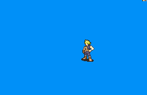

# [\[Mercenary-Custom\] FF7 - Cloud \[M\] by FlyingAce](./) %20Mercenaries%20and%20Heroes%2F%5BMercenary-Custom%5D%20FF7%20-%20Cloud%20%5BM%5D%20by%20FlyingAce%2F8.%20Unarmed) 

## Unarmed

| Still | Animation |
| :---: | :-------: |
|  |  |

## Credit

Made by FlyingAce24.

Improved by Dark Seraph.

Sword (Traditional Ranged) and Sword (Blade Beam) by Seliost1.

Magic animation by Seliost1.

Sword (Materia Magic, and Vanilla) by Seliost1.

Unarmed by Seliost1.
