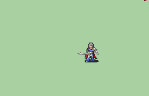

# [\[Sword Custom\] \[M\] Tales of Destiny Magnus by tatutachang](./) %20Myrms%20and%20Swordmasters%2F%5BSword%20Custom%5D%20%5BM%5D%20Tales%20of%20Destiny%20Magnus%20by%20tatutachang%2F1.%20Sword)

## Sword

| Still | Animation |
| :---: | :-------: |
|  |  |

## Credit

Reference/Edit

Chaltier critical animation：Aruka, Kenpuhu

Demon's lance：SHYUTERz

Note: The range attack needs the magic animation Demon's lance to look correct.
