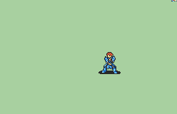

# [\[Sword FE16 Custom\] \[M\] Dread Fighter Short Hair](./) %20Myrms%20and%20Swordmasters%2F%5BSword%20FE16%20Custom%5D%20%5BM%5D%20Dread%20Fighter%20Short%20Hair%2F6.%20Magic) 

## Magic

| Still | Animation |
| :---: | :-------: |
|  |  |

## Credit

F2U/F2E

Original DreadFigther animation made by Nuramon.

Crit from Dino variant by Seliost1.

Short hair + rapier style sword reskin by UltraFenix, commissioned by JPF_09.

Magic animation ported by Seliost1.

