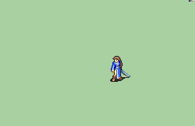

# [\[Swordmaster-Base\] Repal FE6 \[F\]](./) %20Myrms%20and%20Swordmasters%2F%5BSwordmaster-Base%5D%20Repal%20FE6%20%5BF%5D%2F1.%20Sword) 

## Sword

| Still | Animation |
| :---: | :-------: |
|  |  |

## Credit

F2U/F2E

Vanilla animation by IS.

Repal by SinclairX.

Note: Eye colors changed to black (same as the outline, consistent with modern anims).

Boots, in turn, changed to now share the same color palette as the hair.

Smear frames would look weird with the edits: they’re already fixed as well!
