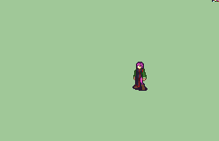

# [\[Swordmaster-Variant\] Eve Tactician Monk \[F\]](./) %20Myrms%20and%20Swordmasters%2F%5BSwordmaster-Variant%5D%20Eve%20Tactician%20Monk%20%5BF%5D%2F6.%20Magic) 

## Magic

| Still | Animation |
| :---: | :-------: |
|  |  |

## Credit

F2U/F2E

A few sword frames are edited from FE7if Alice, though I believe that was originally from bwdyeti's swordmaster? May be mis-remembering.

Aside from that, made by VelvetKitsune.

Zephyrus uses 'spell cast' thing instead of normal hit in 1 range, so it casts spell attached to it when you attack, just a small difference.
