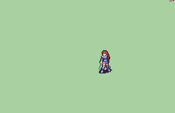

# [\[Swordmaster-Variant\] FE7if and BwdYeti Repalette \[F\]](./) %20Myrms%20and%20Swordmasters%2F%5BSwordmaster-Variant%5D%20FE7if%20and%20BwdYeti%20Repalette%20%5BF%5D%2F8.%20Unarmed) 

## Unarmed

| Still | Animation |
| :---: | :-------: |
|  |  |

## Credit

F2U/F2E

Originally featured in FE7if.

Featuring frames taken from BwdYeti's 'Astra' attack.

Note that while this animation is in the repo and was 'made' by the creators of FE7if, generally their use of BwdYeti's frames without permission is looked-down on.

Unarmed animation by Seliost1.

Astra crit by Seliost1.

Repalette by GigaExcalibur.

Sword (Fixed hand) is a small edit to change the color on the hand. By Seliost1.

Unarmed (fixed palette) is a small edit to change the color on the clothes. By Seliost1.
