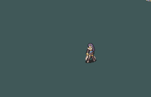

# [\[Swordmaster-Variant\] \[F\] FE7if and BwdYeti](./) %20Myrms%20and%20Swordmasters%2F%5BSwordmaster-Variant%5D%20%5BF%5D%20FE7if%20and%20BwdYeti%2F8.%20Unarmed)

## Unarmed

| Still | Animation |
| :---: | :-------: |
|  |  |

## Credit

Originally featured in FE7if.

Featuring frames taken from BwdYeti's 'Astra' attack.

Note that while this animation is in the repo and was 'made' by the creators of FE7if, generally their use of BwdYeti's frames without permission is looked-down on.

Unarmed animation by Seliost1.
