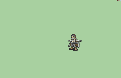

# [\[Assassin-Base\] Legault Vanilla +Bow \[M\]](./) %20Thieves%2C%20Rogues%2C%20Assassins%2F%5BAssassin-Base%5D%20Legault%20Vanilla%20%2BBow%20%5BM%5D%2F5.%20Bow%20%7BAndy%2C%20SD9K%7D) 

## Bow

| Still | Animation |
| :---: | :-------: |
|  |  |

## Credit

F2U/F2E

Base animation by IS.

Bow by Andy, SD9K.

Lyn-Bow by BatimaTheBat.

Magic by Seliost1.
