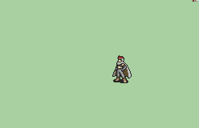

# [\[Assassin-Base\] \[M\] Jaffar Vanilla +Weapons](./) %20Thieves%2C%20Rogues%2C%20Assassins%2F%5BAssassin-Base%5D%20%5BM%5D%20Jaffar%20Vanilla%20%2BWeapons%2F1.%20Knife) 

## Knife

| Still | Animation |
| :---: | :-------: |
|  |  |

## Credit

Sword and Unarmed Vanilla animations by IS.

Sword Alt by DerTheVaporeon.

Sword Fixed and Unarmed Fixed by Glenwing.

Jojo-Jaffar and Knife Alt by DerTheVaporeon.

Knife by JJ09.

Bow by Andy and SD9K.

Sword Fix/Knife Combo by Pushwall, Glenwing, Jj09.

Lyn-Bow by BatimaTheBat.

Magic by Seliost1.
