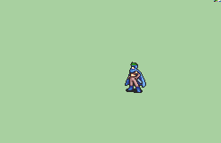

# [\[Assassin-Base\] \[M\] Jaffar Vanilla Repal by Huichelaar](./) %20Thieves%2C%20Rogues%2C%20Assassins%2F%5BAssassin-Base%5D%20%5BM%5D%20Jaffar%20Vanilla%20Repal%20by%20Huichelaar%2F1.%20Knife%20(%2BSword)) 

## Knife

| Still | Animation |
| :---: | :-------: |
|  |  |

## Credit

F2U/F2E

Original animation by IS. 

Knife by JJ09.

Lyn-Bow by BatimaTheBat.

Bow and Knife repal by UltraFenix

Repalette by Huichelaar.

Sword (Knife + Sword) by Itranc.

Small re-repalette by darkjaden
	-(replaced a single pixel in the boots that was taking up a color slot and added a third hair shade)

	-(this animation now shares the exact same palette order as the other Assassin repalette I did of the female ponytail Assassin)
