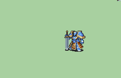

# [\[General-Base\] \[U\] Vanilla +Weapons](./) )

## Sword

| Still | Animation |
| :---: | :-------: |
|  |  |

## Credit

Base General (chainless sword, chained lance/axe) by IS.

Chained Sword by knabepicer.

Chainless Lance by knabepicer, with coding fixes by Dabmaster110.

Greatsword by JPN.

Cannon Bow by GabrielKnight.

Bow and Chainless Axe by TheBlindArcher.

Magic by DerTheVaporeon.

Pincer Blades animation by A Guy That Exists/Existslot.

Marshall style sword by tatutachang. Sword Original Animation by Luerock, Nuramon, Team SALVAGED.

Tomahawk Melee Animation by TheBlindArcher.
