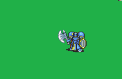

# [\[General-Reskin\] Baron + Chain Weapons \[U\] by Tatata](./) ) 

## Axe

| Still | Animation |
| :---: | :-------: |
|  |  |

## Credit

F2U/F2E

{TBA, St jack, Flasuban, Sax-Marine}

All chain weapon versions by Tatata.

Unarmed (no shield) by Tatata.

