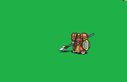

# [\[General-Reskin\] Baron +Weapons \[U\]](./) ) 

## Lance

| Still | Animation |
| :---: | :-------: |
|  |  |

## Credit

F2U/F2E

{TBA, St jack, Flasuban, Sax-Marine}

Staff (Visible) by Flasuban.

All chain weapon versions by Tatata.

Staff (attack) by Tatata.
