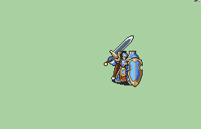

# [\[General-Reskin\] Baron Cape +Weapons \[M\]](./)  

## Sword

| Still | Animation |
| :---: | :-------: |
|  |  |

## Credit

F2U/F2E

Leo_link, Nuramon, Iscaneus, The_Big_Dededester

1. Sword (Magic Flash) {The_Big_Dededester}

Revamped Handaxe by Sax Marine.

Magic by DerTheVaporeon.

Magic (Thunder Shield) by RRSKAI.

Magic Axe animations UltraFenix.

Sword (Alt Range), Lance (Alt Range), Lance (Chainless), Handaxe (Revamped V2.0), Magic (Alt), 7. Staff - All by UltraFenix.
