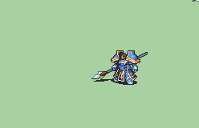

# [\[General-Reskin\] Dark Skin Helmetless \[M\] by Alice](./)  

## Lance

| Still | Animation |
| :---: | :-------: |
|  |  |

## Credit

F2U/F2E

Base General by IS

Tomahawk Melee Animation by TheBlindArcher.

Helmetless and Dark Skin Edit by Alice

Magic Axe frames by Tatutachang.

NOTE: Palettes from Vanilla should mostly be compatible with this animation, as the palette order is the same. Even with the Dark Skin, the lighter "skin" tones are used JUST for the Armor trim.
4th Armor color was turned into 3rd hair color.
