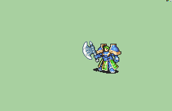

# [\[General-Reskin\] \[M\] Helmetless by Alice V2](./)  

## Axe

| Still | Animation |
| :---: | :-------: |
|  |  |

## Credit

Base General by IS

Tomahawk Melee Animation by TheBlindArcher.

Helmetless Edit by Alice

Magic Axe frames by Tatutachang.

NOTE: Palettes from Vanilla should mostly be compatible with this animation, as the palette order is the same.
4th Armor color was turned into 3rd hair color.
