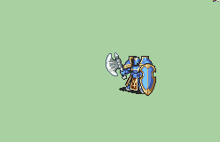

# [\[General-Reskin\] \[U\] Shield v2](./) )

## Axe

| Still | Animation |
| :---: | :-------: |
|  |  |

## Credit

Shield General by TheBlindArcher, DerTheVaporeon, Nuramon.

(Not sure which of the three above did what)

Sword (Magic Flash) by The_Big_Dededester.

Chainless Lance by Pushwall, spliced from knabepicer's work.

Magic by DerTheVaporeon.

Chainsword general by knabepicer, combined into Shield General by Pushwall.

