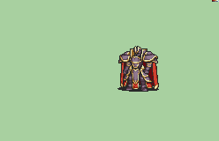

# [\[Marshall\] Black Knight \(Marshall motions\) \[M\]](./) %20%5BM%5D%2F6.%20Magic%20v2) 

## Magic

| Still | Animation |
| :---: | :-------: |
|  |  |

## Credit

F2U/F2E

Animation by Nuramon.

Alondite Wave by Sax Marine.

Black Knight edit by Seliost1.

Magic (v2) by Seliost1. (The right hand is altered.)
