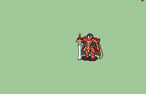

# [\[Marshall\] \[F\] Zelgius v1](./) )

## Sword

| Still | Animation |
| :---: | :-------: |
|  |  |

## Credit

This animation is based on Luerock's Black Knight.

This animation's creator is Nuramon, who sprited and animated everything.

Note: Nuramon went on to make the highly improved overhaul of Zelgius after this.

Female Version by Seliost1.
