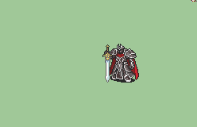

# [\[Marshall\] \[M\] Black Knight by Luerock](./) ) 

## Sword

| Still | Animation |
| :---: | :-------: |
|  |  |

## Credit

Animation by Luerock

Fix by MeteorSR23. This fix adds the attack miss animation and standing motions as well as smoothening the existing attack animations.

Sword (Removed blurs) by Seliost1. (Note: It removes the skill proc aura that the original had during the critical.)
