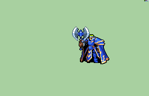

# [\[Zephiel-Base\] King Zephiel Vanilla +Weapons \[M\]](./)  

## Axe

| Still | Animation |
| :---: | :-------: |
|  |  |

## Credit

F2U/F2E

Vanilla animation base and Eckesachs/Unarmed by IS.

All weapon variants sprited by Hairyblob from Deviantart.

Importing/scripting of all new weapons by Maiser6.

Repal Fix by MageBoy.

Eckesachs(No transformation) critical animation：Victor.

Edits by tatutachang.

Sword (Durandal) by Tatata.

Axe (Armads) by Tatata.
