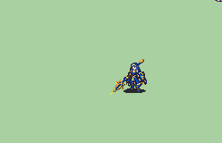

# [\[Eirika-Variant\] \[F\] Brave Lucina \(Celica T2\) by marlon0024](./) %20by%20marlon0024%2F2.%20Lance)

## Lance

| Still | Animation |
| :---: | :-------: |
|  |  |

## Credit

Lance - Marlon, Jeorge_Reds, EA, Smash, Red Bean

Known Issues: Frame 12 shows a sword instead of lance, Frame 54 has a separated piece of the lance floating about
