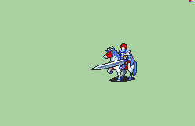

# [\[FE7 Eliwood-Base\] \[M\] T2 Vanilla +Weapons](./) )

## Sword

| Still | Animation |
| :---: | :-------: |
|  |  |

## Credit

Vanilla animation by IS.

Binding Blade by Marlon0024.

Bow by Spud. Alternate dodge frame version by TytheBub.

Durandal Beta Slash edit by TytheBub.

Axe & Handaxe by TytheBub.
