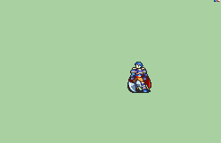

# [\[FE7 Hector-Base\] \[M\] T1 Repal \(Improved\) by Nuramon](./) %20by%20Nuramon%2F3.%20Axe%20(Alt%20Stance)) 

## Axe

| Still | Animation |
| :---: | :-------: |
|  |  |

## Credit

Base animation by IS.

Still by George Reds.

Repalette by Nuramon.

Alt Stance and improvement by RRSKAI.
