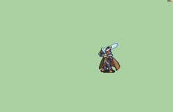

# [\[FE7 Hector-Variant\] T1 Harbinger \[U\] by tatata](./) ) 

## Sword

| Still | Animation |
| :---: | :-------: |
|  |  |

## Credit

F2U/F2E

Animation by tatata.

Sword desgin by Zane Avernathy. Ported by tatata.

Broadsword desgin by Seliost1. Ported by tatata.

Axe (Punch Crit) motion by Vilkalizer. Ported by tatata.

Handaxe (Alt Crit 1/2) motion by Seliost1. Ported by tatata.

