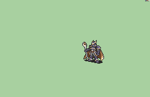

# [\[FE7 Hector-Variant\] T2 Harbinger \[U\] by Nuramon](./)  

## Staff

| Still | Animation |
| :---: | :-------: |
|  |  |

## Credit

F2U/F2E

Original Harbinger by Nuramon.

Special credit to Linkain Arakeist for the magical orb.

Female variant by Mycahel.

Fixes by JJ09.

Staff by GabrielKnight, scripted by ZoramineFae.

Magic (Thunder crit) by Mycahel and ported by Seliost1.
