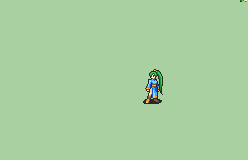

# [\[FE7 Lyn-Base\] \[F\] T1 Repal by Fiuke_Bnuy](./)  

## Unarmed

| Still | Animation |
| :---: | :-------: |
|  |  |

## Credit

Vanilla animation by IS.

Repal by Fiuke_Bnuy.

(The only difference between the "normal" and the "Alt", is that the "ALT" has the vanilla Sheets, but it does not have some little corrections that I made Frame by Frame)
